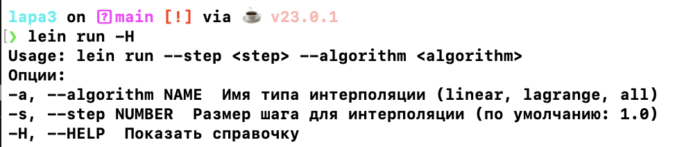
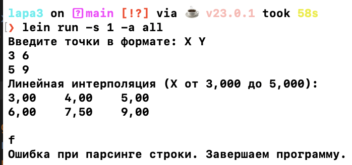
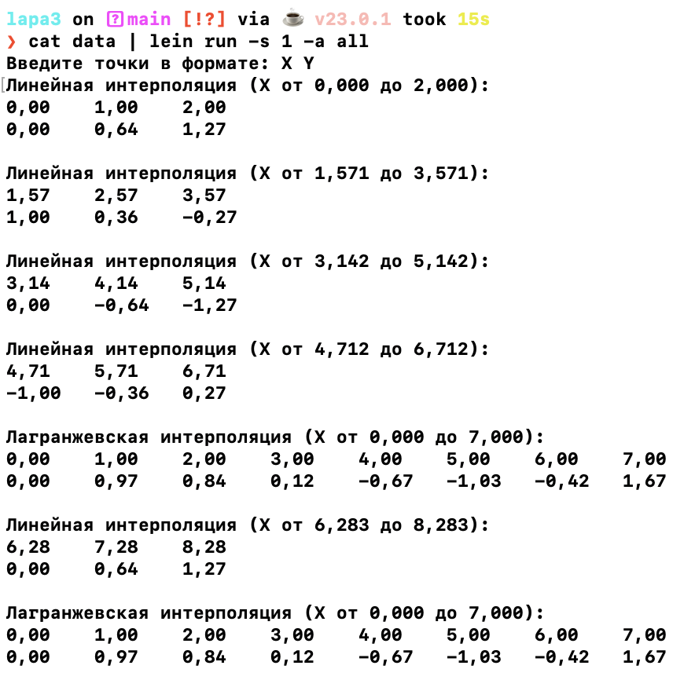

# Лабораторная работа №3

## Титульный лист

**Студент**: Зайцева Ирина Сергеевна

**Группа**: P3309

**ИСУ**: 367222


## Требования к разработанному ПО
Разработанное программное обеспечение реализует функции интерполяции набора точек с использованием двух алгоритмов:
- **Линейная интерполяция** (Linear interpolation);
- **Полиномиальная интерполяция Лагранжа** (Lagrange interpolation).

Программа должна:
1. Принимать точки, заданные пользователем в виде пар координат \(X, Y\).
2. Выполнять интерполяцию на основе входных данных с заданным шагом для значений \(X\).
3. Поддерживать следующие режимы работы:
   - Линейная интерполяция;
   - Интерполяция Лагранжа;
   - Оба алгоритма.
4. Обеспечивать обработку ошибок (например, некорректный формат входных данных).

### Описание алгоритмов
#### Линейная интерполяция
Для пары точек $(x_1, y_1)$ и $(x_2, y_2)$ вычисляются значения $y$ на промежутке $[x_1, x_2]$ с шагом $step$ по формуле:

$$y = y_1 + t \cdot (y_2 - y_1),$$


#### Интерполяция Лагранжа
Для набора точек $(x_i, y_i)$, где $i = 1, \ldots, n$, значение $y$ вычисляется по формуле полинома Лагранжа:

$$L(x) = \sum_{i=1}^n \left(y_i \cdot \prod_{\substack{j=1 \\\\ j \neq i}}^n \frac{x - x_j}{x_i - x_j}\right).$$


## Ключевые элементы реализации

### Основные функции
1. **`my-linear-interpolation`** — выполняет линейную интерполяцию для двух точек.
2. **`lagrange-polynomial`** — вычисляет значение полинома Лагранжа для заданной точки.
3. **`my-lagrange-interpolation`** — выполняет интерполяцию Лагранжа для заданного окна точек.
4. **`process-input`** — основной цикл обработки ввода от пользователя, выполняющий интерполяцию и вывод результатов.
5. **`handle-args`** — разбор аргументов командной строки.

### Примеры ключевых участков кода
#### Линейная интерполяция
```clojure
(defn my-linear-interpolation [points step]
  (let [[p1 p2] points
        [x1 y1] p1
        [x2 y2] p2
        x-values (range x1 (+ step x2) step)]
    (map (fn [x]
           (let [t (/ (- x x1) (- x2 x1))]
             [(double x) (+ y1 (* t (- y2 y1)))]))
         x-values)))
```

#### Интерполяция Лагранжа
```clojure
(defn lagrange-polynomial [points x]
  (let [n (count points)]
    (reduce
     (fn [acc i]
       (let [[xi yi] (nth points i)
             li (reduce (fn [li j]
                          (if (not= i j)
                            (let [[xj _] (nth points j)]
                              (* li (/ (- x xj) (- xi xj))))
                            li))
                        1
                        (range n))]
         (+ acc (* li yi))))
     0
     (range n))))

(defn my-lagrange-interpolation [points step start-x end-x]
  (let [x-values (range start-x (+ end-x step) step)]
    (map (fn [x] [x (lagrange-polynomial points x)]) x-values)))

```

## Ввод/Вывод программы

### Ввод
1. Аргументы командной строки:
   - `--algorithm` — алгоритм интерполяции (`linear`, `lagrange`, `all`).
   - `--step` — шаг интерполяции (по умолчанию 1.0).
2. Ввод координат точек в формате: `X Y` (через пробел, табуляцию или точку с запятой).

### Ввод







## Вывод
Во время лабораторной работы я изучила ввод и вывод данных, потоковую обработку и работу с аргументами командной строки в Clojure. Программа поддерживает динамическое обновление данных и гибко адаптируется к количеству введённых точек. Рассчитанные значения выводятся в удобном формате, что упрощает анализ. Благодаря функциональному подходу реализация алгоритмов интерполяции оказалась простой и понятной. Получены практические навыки работы с потоками, аргументами командной строки и функциональной реализацией алгоритмов.
